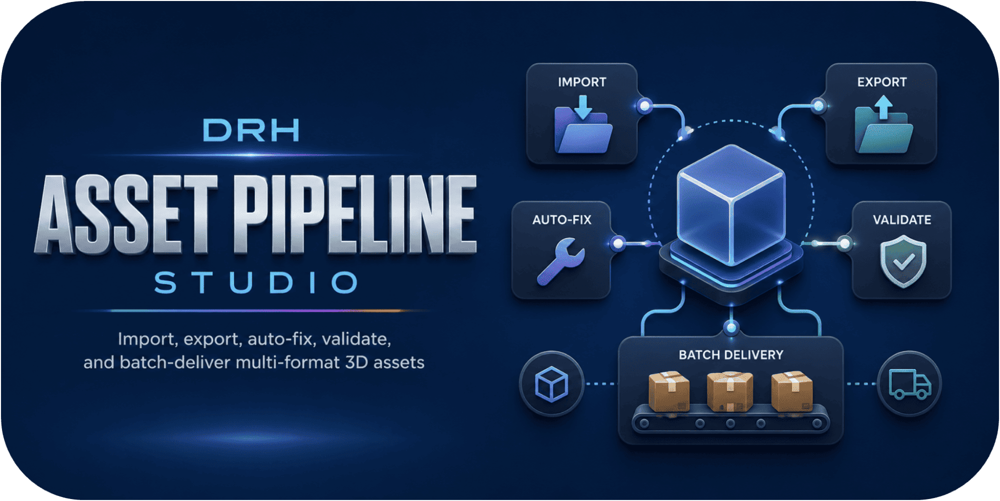
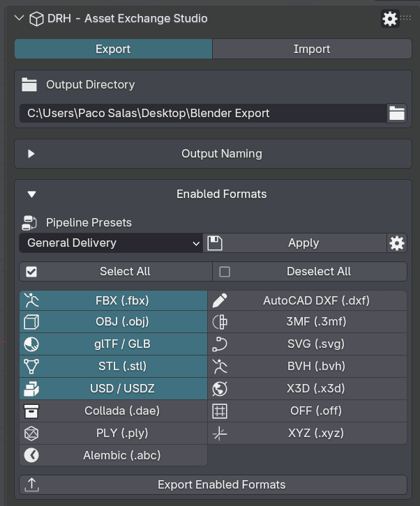
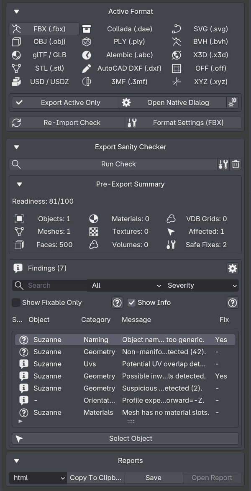
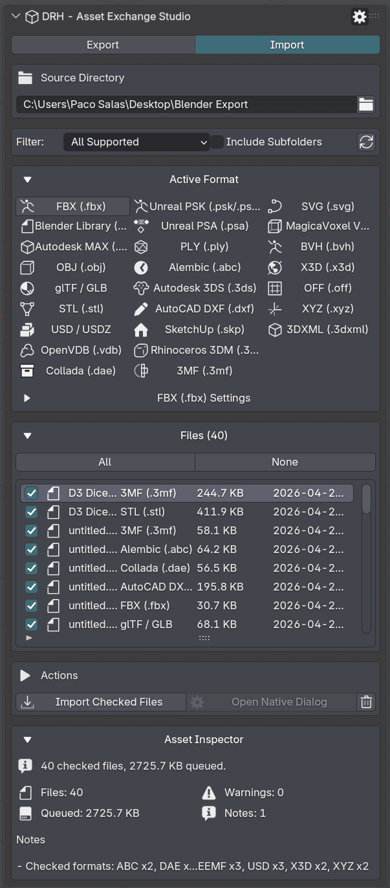
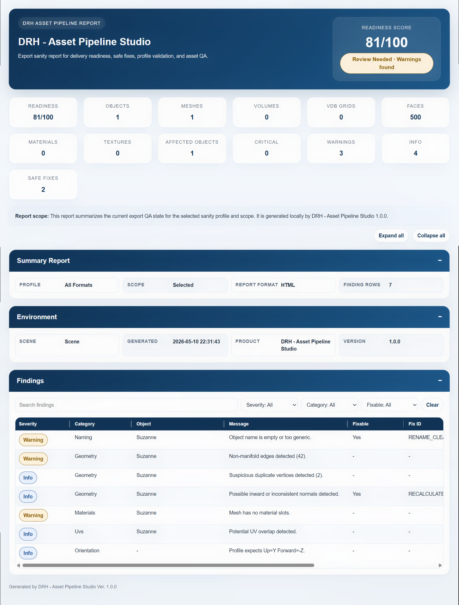

  

 

# DRH - Asset Pipeline Studio

### Public Support Hub · Documentation · Feedback · Pre-release Validation

**A professional Blender add-on for importing, exporting, validating, inspecting, reporting, and batch-processing multi-format 3D assets.**

 

**Part of the DRH Add-ons ecosystem — Blender tools, updates, and releases.**

<!--

-->

---

**DRH - Asset Pipeline Studio** helps Blender users import, export, validate, inspect, report, and batch-process 3D assets across supported file formats and production workflows.

This repository is the central public hub for support, documentation, issue tracking, compatibility feedback, and community validation before marketplace release.

---

  
<strong>📚 Table of Contents</strong>

## Menu

- [Overview](#overview)
- [Media preview](#media-preview)
- [What DRH - Asset Pipeline Studio does](#what-drh---asset-pipeline-studio-does)
- [Supported formats](#supported-formats)
- [Key features](#key-features)
- [Full feature list](#full-feature-list)
- [Who is it for?](#who-is-it-for)
- [Current status](#current-status)
- [Feedback wanted before release](#feedback-wanted-before-release)
- [Quick links](#quick-links)
- [Before you post](#before-you-post)
- [Where to post](#where-to-post)
- [Support policy](#support-policy)
- [Technical notes](#technical-notes)
- [Availability](#availability)
- [Documentation](#documentation)
- [License](#license)

---

## Overview

**DRH - Asset Pipeline Studio** is a Blender import/export and pipeline utility designed to help users move, validate, inspect, and prepare assets across many production formats.

It is intended for technical artists, asset creators, game artists, environment artists, marketplace creators, CAD/ArchViz users, BlenderKit creators, pipeline-focused users, and small teams that need cleaner asset handoff, repeatable export setup, local file scanning, batch-oriented exchange, and format-aware validation.

Instead of manually managing transfers across folders, formats, naming conventions, scene cleanup steps, validation checks, and delivery requirements, DRH - Asset Pipeline Studio centralizes the process inside Blender with dedicated import/export modes, pipeline presets, runtime-aware format handling, and local reporting tools.

## Media preview

<!--

  

-->

<!--

---

### Demo video

Replace `YOUTUBE_VIDEO_ID` with your real YouTube video ID.

Example:
https://www.youtube.com/watch?v=YOUTUBE_VIDEO_ID

  
   
  Click the image to watch the demo on YouTube.

-->

<!--
### Quick demo GIF

Recommended size: 1280x720 or 960x540.

  

-->

### Early Screenshots

| Export Formats and Presets | Export Sanity Checker and Reports |
|---|---|
|  |  |

  
<strong>More Screenshots...</strong>

| Import Formats and File Queue | Export QA Report |
|---|---|
|  |  |

---

## What DRH - Asset Pipeline Studio does

DRH - Asset Pipeline Studio helps you prepare, validate, import, export, inspect, report, and batch-process asset data across supported formats inside Blender.

It is not only a simple import/export shortcut. It is designed as a workflow helper for format-based asset pipelines, asset handoff, file preparation, local organization, validation steps, inspection, previews, and repeatable production-oriented transfer processes.

Use it to:

- Import assets using supported file formats
- Export assets using supported file formats
- Prepare assets for cross-format workflows
- Validate assets before handoff, packaging, or marketplace delivery
- Inspect scene, object, material, texture, and file-related data
- Build local sanity checker reports for QA review
- Batch-export enabled formats from one workflow
- Scan source directories and build import queues
- Filter supported files and optionally include subfolders
- Route imported files into current, scene, per-file, or custom collections
- Use pipeline presets for common delivery workflows
- Reduce repetitive manual import/export preparation
- Support more consistent asset transfer between tools or environments
- Improve pipeline clarity for asset creators and technical users

---

## Supported formats

DRH - Asset Pipeline Studio is built around format-based asset pipeline workflows.

Format availability may depend on Blender version, enabled Blender operators, packaged dependencies, Python ABI, operating system, and format-specific runtime requirements.

---

### Export-capable formats

#### Core 3D formats

#### Scene, animation, and exchange formats

#### CAD, vector, 3D print, and data formats

---

### Import-capable formats

#### Core 3D and Blender formats

#### Scene, animation, and exchange formats

#### CAD, architecture, and DCC formats

#### Game, voxel, volume, vector, and data formats

---

### Format support notes

- Export and import format availability may depend on Blender version, installed or bundled dependencies, operating system, Python ABI, or format-specific requirements.
- Some formats are import-only in the current package.
- Some formats are export-capable and import-capable.
- SketchUp import is packaged for Windows x64 in this release.
- Rhinoceros 3DM import depends on a compatible bundled `rhino3dm` wheel for the active Blender Python build and platform.
- Unsupported runtime paths are designed to fail closed with clear availability messages instead of exposing broken import/export actions.
- Format-specific behavior should be tested with real production files before marketplace release.
- Pipeline presets may enable different format combinations depending on the selected delivery workflow.

---

## Key features

- Multi-format 3D import and export from one production panel
- Export and import modes in Blender’s 3D View sidebar
- File menu import/export entries for supported formats
- Pipeline presets for 3D Print, ArchViz, General Delivery, Godot, glTF Web, Marketplace, OBJ General, Unreal Engine, and Unity delivery
- Batch export workflow for enabled formats
- Directory-based import workflow with source folder scanning and supported-file filtering
- Import queue with refresh, toggle, clear, and import-checked actions
- Optional subfolder scanning for import workflows
- Collection routing to current collection, scene collection, per-file collections, or custom collection
- Export sanity checker and local report generation
- Asset inspection and round-trip-oriented review states
- Scene, object, material, texture, and delivery-oriented validation checks
- Runtime-aware format availability handling
- Local-only workflow with no external service or account requirement for normal operation

---

  
<strong>🧩 Full feature list</strong>

## Full feature list

### Multi-Format Pipeline

- Unified import and export workflow
- Format-aware asset pipeline
- Local file-based processing
- Format-specific availability handling
- Runtime messages for unsupported formats or unavailable operators
- Import/export menu integration
- 3D View sidebar workflow panel

### Supported Formats

| Content Creation & Exchange | Game Engine & Animation Pipelines | CAD, Design & Fabrication | Specialized Data Formats |
|---|---|---|---|
| - FBX | - Unreal PSK / PSKX | - Autodesk MAX | - OpenVDB |
| - BLEND import | - Unreal PSA | - Autodesk 3DS | - SVG |
| - OBJ | - BVH | - STL | - VOX |
| - glTF / GLB | - Alembic | - USD / USDA / USDC / USDZ | - OFF |
| - DAE / Collada | - X3D / WRL | - DXF | - XYZ |
| - PLY |  | - SKP | - 3DXML |
|  |  | - 3DM | - 3MF |

### Export Workflow

- Output directory selection
- Enabled format selection
- Active export format switching
- Batch export for enabled formats
- Format-specific export option panels
- Transform and scale controls
- Selection-based export where supported
- Animation-aware export options where supported
- Path and file naming handling
- Unique path handling for export outputs
- Cleanup and transform controls for supported formats

### Import Workflow

- Source directory selection
- Refresh import file list
- Toggle checked files
- Clear file list
- Import checked files
- Supported-format filtering
- Include subfolders option
- Import queue workflow
- Format-specific import option panels
- Native import fallback flow where available
- Collection routing to current collection
- Collection routing to scene collection
- Collection routing per file
- Collection routing to a custom collection
- Manual import inspector option in preferences

### Pipeline Presets

- 3D Print preset
- ArchViz Exchange preset
- General Delivery preset
- Godot preset
- glTF Web preset
- Marketplace preset
- OBJ General preset
- Unreal Engine preset
- Unity preset
- Auto-apply preset workflow
- Sync sanity profile
- Sync enabled formats
- Sync import workflow

### Validation & Inspection

- Export sanity checker workflow
- Inspector report summary
- Scene metrics review
- Object metrics review
- Material metrics review
- Texture metrics review
- Delivery-oriented sanity profiles
- Round-trip status states: Pass, Warn, Fail, None
- Local QA/report output
- Findings with severity, category, object, message, fixability, fix ID, and details

### Batch & Handoff

- Batch export workflow
- Repeated handoff preparation
- Marketplace delivery preparation
- Asset-library preparation
- Client delivery cleanup workflow
- Format-specific delivery preparation
- Local path and folder-based exchange

### Package and Runtime

- Source-based Blender extension package
- Blender 4.2+ minimum
- Windows x64 package declaration
- Bundled Rhino wheel files for compatible Windows Blender Python builds
- Bundled SketchUp native components for Windows x64 package support
- Clear runtime messages when a format is not available in the current build or platform

---

## Who is it for?

DRH - Asset Pipeline Studio is designed for:

- Technical artists
- Blender asset creators
- Game artists
- Environment artists
- Pipeline-focused users
- ArchViz and CAD exchange users
- Marketplace asset creators
- BlenderKit creators
- Small teams and solo creators
- Users managing repeated import/export tasks
- Users preparing asset packs, libraries, or deliverables
- Users working with format-based asset pipelines
- Users who need cleaner asset transfer, validation, inspection, and handoff workflows

---

## Current status

| Item | Details |
|---|---|
| **Status** | 🟣 In Development |
| **Current version** | 1.0.0 |
| **Add-on name** | DRH - Asset Pipeline Studio |
| **Extension ID** | `drh_asset_pipeline_studio` |
| **Minimum Blender version** | 4.2.0 |
| **Platforms** | Windows x64 |
| **Type** | Blender add-on |
| **Category / Tags** | Import-Export, Pipeline |
| **Maintainer** | Paco Salas \| DRH |
| **License** | GPL-3.0-or-later |
| **Release type** | In development before public marketplace release |
| **Support repository** | [DRH Asset Pipeline Studio Support](https://github.com/pacosalasv/DRH_Asset_Pipeline_Studio-Support) |

This add-on is currently in development. Compatibility feedback, usability comments, feature expectations, and workflow suggestions are welcome before public release.

---

## Feedback wanted before release

This repository is open for public feedback before marketplace release.

Feedback is especially welcome on:

- Feature usefulness
- Supported import formats
- Supported export formats
- Format-specific workflow expectations
- Format validation requirements
- Import workflow expectations
- Export workflow expectations
- Batch-processing workflow needs
- Export sanity checker expectations
- Local report requirements
- Asset validation needs
- Local file handling expectations
- Path-based workflow requirements
- Pipeline preset ideas
- Marketplace or asset library preparation needs
- Pipeline and handoff requirements
- Compatibility concerns
- Installation experience
- Documentation clarity
- Expected pricing
- Marketplace expectations

Useful feedback examples:

> “I need `.fbx`, `.obj`, and `.glb` export for game-ready assets.”

> “I need `.3dm`, `.skp`, and `.3ds` import for architecture-related workflows.”

> “This should validate missing textures before export.”

> “I need batch export options for multiple assets and formats.”

> “This would be useful if it helps organize marketplace-ready asset packages.”

> “The workflow should clearly show which formats are supported for import and export.”

> “Format-specific presets would make this more useful for game engines and asset stores.”

> “I need clear runtime messages when a format is unavailable on my operating system or Blender build.”

---

## Quick links

- [Support repository](https://github.com/pacosalasv/DRH_Asset_Pipeline_Studio-Support)
- [Ask a question in Discussions](https://github.com/pacosalasv/DRH_Asset_Pipeline_Studio-Support/discussions)
- [Open a new issue](https://github.com/pacosalasv/DRH_Asset_Pipeline_Studio-Support/issues/new/choose)
- [Report a bug](https://github.com/pacosalasv/DRH_Asset_Pipeline_Studio-Support/issues/new?template=bug_report.yml)
- [Request a feature](https://github.com/pacosalasv/DRH_Asset_Pipeline_Studio-Support/issues/new?template=feature_request.yml)
- [Report a compatibility issue](https://github.com/pacosalasv/DRH_Asset_Pipeline_Studio-Support/issues/new?template=compatibility_issue.yml)

---

## Before you post

Please include as much of the following information as possible:

- Add-on version
- Blender version
- Operating system
- Blender Python version, if known
- Installation method
- Clear steps to reproduce
- Expected result
- Actual result
- Error message, screenshot, or console output when available

For compatibility issues, please also include:

- Blender build type, if known
- Portable or installed Blender version
- Whether the issue happens with a clean Blender configuration
- Asset type or format involved, if relevant
- Import or export direction
- Import format used
- Export format used
- Local path structure, when safe to share
- Whether the issue involves file access, validation, missing files, asset transfer, format conversion, batch-processing, report output, or path handling
- Whether the format appears disabled or reports a runtime availability message

---

## Use Discussions for

- Questions
- How-to topics
- Installation help
- Compatibility checks
- FAQ
- Suggestions
- Pre-release feedback
- Pricing feedback
- Workflow ideas
- Format support requests
- Pipeline use-case discussions

---

## Use Issues for

- Confirmed bugs
- Reproducible compatibility problems
- Format-specific import/export problems
- Feature requests
- Regressions
- Marketplace or listing-related problems
- Documentation errors

---

## Where to post

Open a **Discussion** for:

- General questions
- Setup help
- Workflow advice
- Suggestions
- Early feedback
- Format support requests
- Pipeline workflow ideas

Open an **Issue** for:

- Confirmed bugs
- Reproducible compatibility problems
- Import/export failures
- Format-specific problems
- Regressions
- Feature requests
- Documentation problems

---

## Support policy

This repository is a public support hub.

Do not post:

- Private account details
- License keys
- Payment information
- Confidential production files
- Private client files
- Sensitive system information

If a private file is required to reproduce an issue, please describe the problem first and wait for further instructions.

---

## Technical notes

This add-on is source based, with:

- No obfuscation
- No external services required for normal operation
- No account requirements for normal operation
- No external downloads required for normal operation

Local file access may be used for:

- Import workflows
- Export workflows
- Format-based asset pipelines
- Source directory scanning
- Asset transfer
- Asset validation
- Asset inspection
- Local validation reports
- Local file handling
- Path-based workflows
- Asset package preparation
- Project or asset folder selection
- Batch-processing workflows

The add-on is intended to work locally inside Blender.

Current package notes:

- Minimum Blender version: 4.2.0
- Platform currently indicated in package metadata: Windows x64
- Sidebar tab: `DRH-Asset Pipeline`
- Panel label: `DRH - Asset Pipeline Studio`
- Blender category: Import-Export
- Extension ID: `drh_asset_pipeline_studio`
- SketchUp import uses bundled Windows native components and is currently packaged for Windows x64.
- Rhinoceros 3DM import depends on compatible bundled `rhino3dm` wheels for the current Blender Python ABI and platform.
- Format support may depend on Blender version, available import/export operators, bundled dependencies, Python ABI, and operating system support.

---

## Availability

This add-on may be available through multiple marketplaces and storefronts after release.

This GitHub repository remains the central public location for:

- Support
- Documentation
- Issue tracking
- Compatibility reports
- Public feedback
- Release notes

---

## Documentation

- [User Manual](docs/manual/user-manual.pdf)
- [Changelog](CHANGELOG.md)

---

## License

This repository is distributed under **GPL-3.0-or-later**.

---

### DRH Add-ons

**Blender tools, updates, and releases.**

Built for clean workflows, practical utilities, and production-friendly Blender setups.

