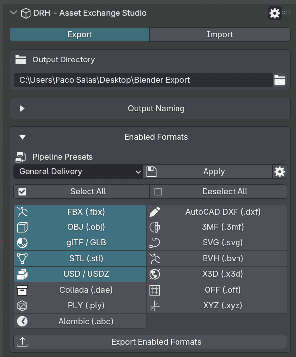
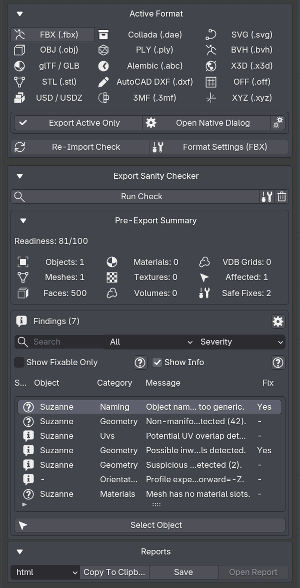
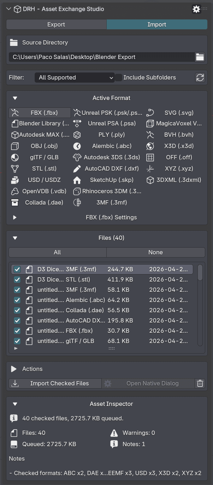
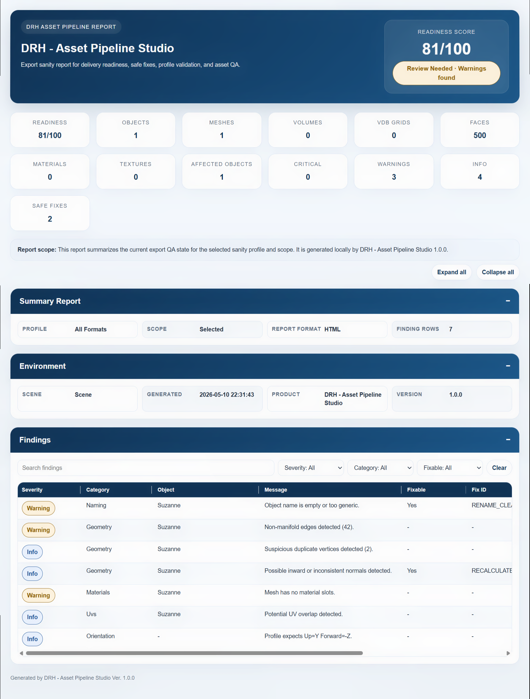

# DRH - Asset Pipeline Studio

**Import, export, auto-fix, validate, and batch-deliver multi-format 3D assets in Blender**

   

 

---

## Overview

DRH - Asset Pipeline Studio is a Blender import/export and pipeline utility designed to help users move, validate, inspect, and prepare assets across many production formats.

It is intended for technical artists, asset creators, game artists, environment artists, marketplace creators, CAD/ArchViz users, BlendKit creators, pipeline-focused users, and small teams that need cleaner asset handoff, repeatable export setup, local file scanning, batch-oriented exchange, and format-aware validation.

## Key features

| Details |
|---|
| Multi-format 3D import and export from one production panel |
| Export and import modes in Blender's 3D View sidebar |
| File menu import/export entries for supported formats |
| Pipeline presets for 3D Print, ArchViz, General Delivery, Godot, glTF Web, Marketplace, OBJ General, Unreal Engine, and Unity delivery |
| Batch export workflow for enabled formats |
| Directory-based import workflow with source folder scanning and supported-file filtering |
| Import queue with refresh, toggle, clear, and import-checked actions |
| Optional subfolder scanning for import workflows |
| Collection routing to current collection, scene collection, per-file collections, or custom collection |
| Export sanity checker and local report generation |
| Asset inspection and round-trip-oriented review states |
| Scene, object, material, texture, and delivery-oriented validation checks |
| Runtime-aware format availability handling |
| Local-only workflow with no external service or account requirement for normal operation |

## Detailed features

Open detailed features

### Feature details

#### Multi-format pipeline
| Details |
|---|
| Unified import and export workflow |
| Format-aware asset pipeline |
| Local file-based processing |
| Format-specific availability handling |
| Runtime messages for unsupported formats or unavailable operators |
| Import/export menu integration |
| 3D View sidebar workflow panel |

#### Supported formats
| Content Creation & Exchange | Game Engine & Animation Pipelines | CAD, Design & Fabrication | Specialized Data Formats |
|---|---|---|---|
| - FBX | - Unreal PSK / PSKX | - Autodesk MAX | - OpenVDB |
| - BLEND import | - Unreal PSA | - Autodesk 3DS | - SVG |
| - OBJ | - BVH | - STL | - VOX |
| - glTF / GLB | - Alembic | - USD / USDA / USDC / USDZ | - OFF |
| - DAE / Collada | - X3D / WRL | - DXF | - XYZ |
| - PLY |  | - SKP | - 3DXML |
|  |  | - 3DM | - 3MF |

#### Export workflow
| Details |
|---|
| Output directory selection |
| Enabled format selection |
| Active export format switching |
| Batch export for enabled formats |
| Format-specific export option panels |
| Transform and scale controls |
| Selection-based export where supported |
| Animation-aware export options where supported |
| Path and file naming handling |
| Unique path handling for export outputs |
| Cleanup and transform controls for supported formats |

#### Import workflow
| Details |
|---|
| Source directory selection |
| Refresh import file list |
| Toggle checked files |
| Clear file list |
| Import checked files |
| Supported-format filtering |
| Include subfolders option |
| Import queue workflow |
| Format-specific import option panels |
| Native import fallback flow where available |
| Collection routing to current collection |
| Collection routing to scene collection |
| Collection routing per file |
| Collection routing to a custom collection |
| Manual import inspector option in preferences |

#### Pipeline presets
| Details |
|---|
| 3D Print preset |
| ArchViz Exchange preset |
| General Delivery preset |
| Godot preset |
| glTF Web preset |
| Marketplace preset |
| OBJ General preset |
| Unreal Engine preset |
| Unity preset |
| Auto-apply preset workflow |
| Sync sanity profile |
| Sync enabled formats |
| Sync import workflow |

#### Validation and inspection
| Details |
|---|
| Export sanity checker workflow |
| Inspector report summary |
| Scene metrics review |
| Object metrics review |
| Material metrics review |
| Texture metrics review |
| Delivery-oriented sanity profiles |
| Round-trip status states: Pass, Warn, Fail, None |
| Local QA/report output |
| Findings with severity, category, object, message, fixability, fix ID, and details |

#### Batch and handoff
| Details |
|---|
| Batch export workflow |
| Repeated handoff preparation |
| Marketplace delivery preparation |
| Asset-library preparation |
| Client delivery cleanup workflow |
| Format-specific delivery preparation |
| Local path and folder-based exchange |

#### Package and runtime
| Details |
|---|
| Source-based Blender extension package |
| Blender 4.2+ minimum |
| Windows x64 package declaration |
| Bundled Rhino wheel files for compatible Windows Blender Python builds |
| Bundled SketchUp native components for Windows x64 package support |
| Clear runtime messages when a format is not available in the current build or platform |

## Product status

| Item | Details |
|---|---|
| Status | **Development On Hold** |
| Version | 1.0.0 |
| Blender | 4.2+ |
| Platforms | Windows x64 |
| Availability | Development is currently on hold; no public download is promoted from this repository. |
| Distribution | Support, documentation, and development history. |
| Repository role | Documentation, support, issue tracking, compatibility feedback, and product feedback |

The repository remains available for documentation and feedback while active development is paused.

## Media

Product screenshots:

  
  
  
  

## Documentation and support

| Resource | Link |
|---|---|
| Support guide | [SUPPORT.md](SUPPORT.md) |
| User manual | [PDF manual](docs/manual/user-manual.pdf) |
| Repository changelog | [CHANGELOG.md](CHANGELOG.md) |
| Issues | [Open or review issues](https://github.com/pacosalasv/DRH_Asset_Pipeline_Studio-Support/issues) |
| Discussions | [Ask questions and share feedback](https://github.com/pacosalasv/DRH_Asset_Pipeline_Studio-Support/discussions) |

## Support development

Support is optional. Ko-fi and PayPal contributions help fund maintenance, Blender compatibility work, documentation, testing, and continued development of free DRH tools.

  
   
  <strong>Prefer PayPal?</strong> <a href="https://www.paypal.com/paypalme/pacosalas?locale.x=en_US&country.x=MX">Support DRH development with PayPal</a>

## Ecosystem

| Destination | Link |
|---|---|
| Support development | [Ko-fi](https://ko-fi.com/pacosalasv) |
| PayPal | [Support development](https://www.paypal.com/paypalme/pacosalas?locale.x=en_US&country.x=MX) |
| Issues & feedback | [GitHub Issues](https://github.com/pacosalasv/DRH_Asset_Pipeline_Studio-Support/issues) |
| DRH Add-ons Hub | [Catalog and roadmap](https://github.com/pacosalasv/DRH_Addons_Hub) |
| BlendKit | [DRH Blender catalog](https://www.blendkit.com/?query=author_id:205846) |
| Paco Salas \| DRH | [Official site](https://pacosalasv.blogspot.com/) |
| Xtreme Mindset | [Product lab](https://xtrememindset.blogspot.com/) |
| Sketchfab / Código Píxel | [3D model collections](https://sketchfab.com/codigopixel/collections) |
| KreaOn | [Technology education](https://www.kreaon.com/) |
| PiNu | [Connected physical products](https://pinu.com.mx/) |
| GitHub | [pacosalasv](https://github.com/pacosalasv) |

## License

See [LICENSE](LICENSE) for repository licensing terms.
